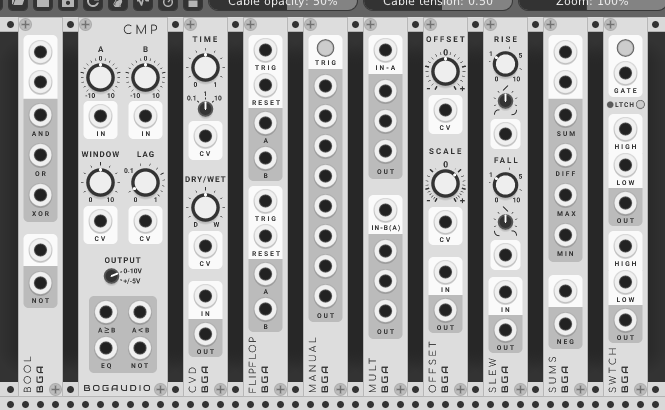
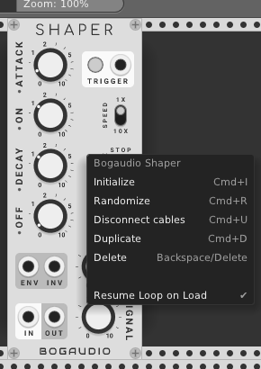

# BogaudioModules
Modules for [VCV Rack](https://github.com/VCVRack/Rack), an open-source Eurorack-style virtual modular synthesizer.


Jump to [envelopes](#envelopes), the [spectrum analyzer](#analyzer), or the [utilities](#utilities).

## Builds/Releases

Find downloadable builds for **Mac**, **Windows** and **Linux** on on the [releases page](https://github.com/bogaudio/BogaudioModules/releases).

## Building

You'll need to be set up to build [VCV Rack](https://github.com/VCVRack/Rack) itself.  Switch to the `plugins/` directory there, then:

  ```
  git clone https://github.com/bogaudio/BogaudioModules.git
  cd BogaudioModules
  make
  ```

To build for a particular version of Rack, check out the corresponding branch:

  ```
  (in plugins/BogaudioModules:)
  git fetch
  git checkout v0.4.0
  make
  ```

## Modules

### <a name="envelopes"></a> Envelopes

#### SHAPER

SHAPER emulates the function of the Envelope Generator section of the classic [EMS VC3](https://en.wikipedia.org/wiki/EMS_VCS_3) and related synths.  It combines an envelope with a VCA.  Unlike an ADSR, the envelope stages are Attack, On, Decay and Off -- with linear movement in the attack and decay stages, this produces a signature trapezoidal envelope shape.


Features:
  - The ATTACK, ON, DECAY and OFF knobs specify times from nearly zero to 10 seconds.  The Speed switch allows these times to be multiplied by 10.
  - The trapezoid envelope is output as a 0-10 control signal at port ENV, subject to attenuation by the ENV knob.  (INV outputs the inverse envelope.)
  - Audio input at port IN is sent through the internal VCA -- controlled by knob SIGNAL and the envelope -- to port OUT.
  - A trigger CV at the TRIGGER port, or a press of the TRIGGER button, will start the envelope cycle.  When the off stage completes, a trigger is sent out at port END.  If the CYCLE switch is set to LOOP, the envelope restarts immediately.

#### SHAPER+

SHAPER+ is a SHAPER, with the addition of CV inputs for each knob, and gate outputs for each stage (a stage's gate output will be high for the duration of the stage).

#### DADSRH

DADSRH (Delay Attack Decay Sustain Release Hold) augments a standard ADSR with a delay stage and a self-gating (hold) mode.


Features:
  - When the MODE switch is set to GATE, DADSRH is a more-or-less standard ADSR envelope generator, with an additional pre-attack delay stage.  The envelope is controlled by a gate CV at the trigger port, or by holding the TRIGGER button.
  - When MODE is TRIG, a trigger CV or press of the TRIGGER button will start a normal DADSR cycle, but controlled by an internal gate CV.  The internal gate persists for the time set by the HOLD knob.
  - The envelope is output as a 0-10 signal at port ENV.  Its inverse (actually, 10 - ENV) is output at INV.  When a release stage completes, a trigger is output at END.
  - When MODE is TRIGGER, the CYCLE switch controls whether the envelope loops or not upon completion of a release stage.
  - Toggles allow selection of linear, exponential or inverse-exponential shapes for the attack, decay and release stages.
  - The RETRIG switch controls the retrigger behavior (when a new gate or trigger happens while the envelope is running): ATT immediately attacks from the current envelope value (this is the typical behavior with many ADSRs), while RST causes a full reset of the envelope (restarting it at the delay stage).

#### DADSRH+

DADSRH+ is a DADSRH, with the addition of CV inputs for each knob, and gate outputs for each stage (a stage's gate output will be high for the duration of the stage).

### <a name="analyzer"></a> Analyzer

A four-channel spectrum analyzer.


Features:
  - Range setting: smoothly scrolls the displayed frequency range, from just the lower tenth, to the entire range (up to half the sampling rate).
  - Smooth setting: controls how many analysis frames will be averaged to drive the display.  A higher setting reduces jitter, at the expense of time lag.  For convenience, the knob setting is time-valued, from zero to half a second (internally this is converted to an integer averaging factor based on the sample rate and other settings).
  - Quality setting: switch between good (1024-sample) and better (4096-sample) FFT window sizes.  The higher setting yields finer frequency resolution at a higher CPU cost.
  - Off button: turn the unit off to save some CPU without unpatching.


### <a name="utilities"></a> Utilities

A collection of compact 3-HP utility modules.



#### DETUNE

A 1V/octave pitch processor, for controlling a detuned oscillator pair.  A reference pitch in raised and lowered by the number of cents (hundredths of a semitone) specified by the knob and CV, and output at OUT+ and OUT-.  The input pitch is output at THRU.

#### DGATE

A triggerable gate with duration up to 10 seconds, with an optional pre-delay of up to 10 seconds.  A trigger pulse is output at END when a delay/gate cycle ends.  If the STOP/LOOP switch is set to LOOP, or if the trigger is high when the cycle ends, the cycle repeats.

#### MANUAL

A manual trigger/gate with 8 outputs.  A constant high value is sent from each output for as long as the TRIG button is held.

#### NOISE

A noise source, in types White, Pink (1/f), Red (aka Brown, 1/f^2) and Gauss (normal with mean 0 and variance 1).

Additionally, NOISE has an absolute value circuit.  Patch audio into ABS to get positive CV.  For example, patch White into ABS to get uniform values in the range 0 to 10.

#### OFFSET

An offset and scaler.  The OFFSET and SCALE knobs have CV inputs.  With an input signal, output is `(input + offset) * scale`.  With no input connected, the output is constant in the value of `offset * scale`.

#### REFTONE

A tuner that outputs a selectable (Western, chromatic) pitch as CV (1v/octave, for controlling an oscillator) or as a pure sine tone.  The base pitch is selected with the PITCH and OCTAVE knobs, while the FINE knob allows the output to be fine-tuned up or down a full semitone.  The LED-style display indicates the selected pitch, octave and fine tuning (in cents), and the corresponding frequency (in hertz).

#### S&H

A dual sample-and-hold.  Sampling may be triggered by CV or button press.  If nothing is connected to an IN port, sampling for that channel is from an internal white noise source (range 0-10).

#### STACK

A 1V/octave pitch processor for stacking oscillators.  The SEMIS, OCTAVE and FINE knobs determine an interval (up or down) to apply to the input pitch and send to OUT.  The input pitch is sent unmodified to THRU, for ease of chaining multiple STACKs to control multiple oscillators, e.g. to create chords.

The CV input expects +/-5 volts; the value modifies the interval set by the knobs in the amount of one semitone per tenth volt.  If QZ (quantize) is active, the CV-controlled interval is quantized to the nearest semitone.  This specialized CV is output at the THRU port, with a value set by the knobs and CV in, when there is no input pitch.

#### SWITCH

A signal-routing module with two through channels.  If the button is held or the GATE input is high, the HIGH input for each channel is routed to the corresponding OUT.  Otherwise, each LOW input is routed to each OUT.

#### VCA

A compact, two-channel VCA.

## Other Notes

#### <a name="resumeloop"></a> Loop Behavior on Patch Load

Modules Shaper, Shaper+, DADSRH, DADSHR+ and DGATE can each be set to loop.  As of release 0.5.3, these modules will automatically being running (looping) when the patch loads if they were looping when the patch was saved.  (Previously, they would require a trigger to resume looping.)

This behavior can be disabled on a per-module basis by right-clicking the module and unchecking "Resume Loop on Load".



## Issues and Feedback

Bug reports and feedback are welcome: please use the [issue tracker](https://github.com/bogaudio/BogaudioModules/issues).

## Acknowledgements

Uses [FFTReal](https://github.com/cyrilcode/fft-real) under the DWTFYWT Public License.
